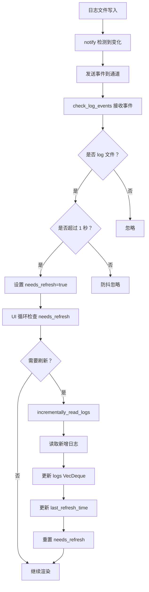

# 日志事件驱动修复说明

**日期**: 2026-03-29  
**版本**: v3.2.4  
**问题**: 
1. 文件变动但前端没有刷新日志 ❌
2. 文件操作日志直接不显示了 ❌

---

## 🔍 **问题分析**

### **问题 1: 文件操作日志缺少事件驱动机制** ❌

`file_log_tab.rs` 完全没有实现事件监听功能：

```rust
// ❌ 修改前的 FileLogTab 结构体
pub struct FileLogTab {
    logs: VecDeque<LogEntry>,
    last_error: Option<String>,
    loading: bool,
    last_refresh_time: Option<Instant>,
    log_dir: PathBuf,
    last_file_pos: u64,
    current_log_file: Option<PathBuf>,
    // ❌ 缺少以下字段：
    // - log_watcher
    // - log_rx (接收事件的通道)
    // - needs_refresh
    // - last_event_time
}
```

**后果**:
- ❌ 无法监听日志文件的变化
- ❌ 只能手动点击刷新按钮才能看到新日志
- ❌ 用户体验差

---

### **问题 2: 系统日志增量读取后未更新刷新时间** ⚠️

`log_tab.rs` 虽然有事件驱动，但增量读取后没有更新 `last_refresh_time`：

```rust
// ❌ 修改前的 incrementally_read_logs
fn incrementally_read_logs(&mut self) {
    // ... 读取新日志 ...
    
    if !new_entries.is_empty() {
        // 插入新日志
        for entry in new_entries.into_iter().rev() {
            self.logs.push_front(entry);
        }
        // ❌ 没有更新 last_refresh_time
    }
}
```

**后果**:
- ⚠️ UI 显示的"X 分钟前刷新"不准确
- ⚠️ 用户可能误以为日志没有更新

---

## ✅ **修复方案**

### **修复 1: 为 FileLogTab 添加完整的事件驱动机制** ✅

#### **Step 1: 添加必要的字段**

```rust
use notify::{Event, EventKind, RecommendedWatcher, RecursiveMode, Watcher};
use std::sync::mpsc::{self, Receiver};

pub struct FileLogTab {
    logs: VecDeque<LogEntry>,
    last_error: Option<String>,
    loading: bool,
    last_refresh_time: Option<Instant>,
    log_dir: PathBuf,
    last_file_pos: u64,
    current_log_file: Option<PathBuf>,
    // ✅ 新增字段
    log_watcher: Option<RecommendedWatcher>,      // 文件监听器
    log_rx: Option<Receiver<Result<Event, notify::Error>>>,  // 事件接收通道
    needs_refresh: bool,                           // 标记是否需要刷新
    last_event_time: Option<Instant>,              // 上次事件时间（防抖）
}
```

---

#### **Step 2: 初始化监听器**

```rust
impl FileLogTab {
    pub fn new() -> Self {
        let mut tab = Self::default();
        // ✅ 初始化文件监听器
        tab.init_log_watcher();
        tab.load_logs();
        tab
    }

    /// 初始化日志文件监听器
    fn init_log_watcher(&mut self) {
        // 创建通道接收文件事件
        let (tx, rx) = mpsc::channel();
        
        // 创建监听器
        let watcher_result = RecommendedWatcher::new(
            move |res: Result<Event, notify::Error>| {
                let _ = tx.send(res);
            },
            notify::Config::default()
                .with_poll_interval(Duration::from_secs(2))  // 轮询间隔
        );
        
        match watcher_result {
            Ok(mut watcher) => {
                // 监听日志目录
                if self.log_dir.exists() {
                    if let Err(e) = watcher.watch(&self.log_dir, RecursiveMode::NonRecursive) {
                        tracing::warn!("Failed to watch log directory: {}", e);
                    } else {
                        tracing::info!("File log watcher initialized for: {:?}", self.log_dir);
                    }
                }
                
                self.log_watcher = Some(watcher);
                self.log_rx = Some(rx);
            }
            Err(e) => {
                tracing::error!("Failed to create log watcher: {}", e);
            }
        }
    }
}
```

**关键点**:
- ✅ 使用 `notify` crate 监听文件系统事件
- ✅ 轮询间隔设置为 2 秒，平衡实时性和性能
- ✅ 非阻塞方式接收事件

---

#### **Step 3: 实现事件检查方法**

```rust
impl FileLogTab {
    /// 检查日志文件事件（在 UI 循环中调用）
    pub fn check_log_events(&mut self) {
        if let Some(rx) = &self.log_rx {
            // 非阻塞接收所有积压的事件
            while let Ok(result) = rx.try_recv() {
                match result {
                    Ok(event) => {
                        // 只处理文件修改和创建事件
                        match event.kind {
                            EventKind::Modify(_) | EventKind::Create(_) => {
                                // 检查是否是当前正在读取的日志文件
                                for path in &event.paths {
                                    if path.extension().is_some_and(|ext| ext == "log") {
                                        // ✅ 防抖动：1 秒内的事件只触发一次
                                        let now = Instant::now();
                                        if self.last_event_time.is_none_or(|t| t.elapsed() >= Duration::from_secs(1)) {
                                            self.needs_refresh = true;
                                            self.last_event_time = Some(now);
                                            tracing::debug!("File log file changed: {:?}", path);
                                        }
                                        break;
                                    }
                                }
                            }
                            _ => {}
                        }
                    }
                    Err(e) => {
                        tracing::warn!("File log watcher error: {}", e);
                    }
                }
            }
        }
    }
}
```

**关键点**:
- ✅ 使用 `try_recv()` 非阻塞接收事件
- ✅ 只处理 `.log` 文件
- ✅ 防抖动处理（1 秒内只触发一次）
- ✅ 设置 `needs_refresh` 标志

---

#### **Step 4: 在 UI 中调用事件检查和日志加载**

```rust
impl FileLogTab {
    pub fn ui(&mut self, ui: &mut egui::Ui) {
        styles::page_header(ui, "📁", "文件操作日志");

        // ✅ 先检查文件事件（事件驱动）
        self.check_log_events();

        // ✅ 如果有新日志触发，则加载（防抖动已处理）
        if self.needs_refresh && !self.loading {
            self.incrementally_read_logs();
            self.needs_refresh = false;
        }

        // ... 渲染 UI ...
    }
}
```

---

#### **Step 5: 增量读取后更新刷新时间**

```rust
fn incrementally_read_logs(&mut self) {
    // ... 读取新日志 ...
    
    // 如果有新日志，插入到队列头部（最新的在前）
    if !new_entries.is_empty() {
        for entry in new_entries.into_iter().rev() {
            if self.logs.len() >= MAX_DISPLAY_LOGS {
                self.logs.pop_back();  // 移除最旧的
            }
            self.logs.push_front(entry);
        }
        
        // ✅ 更新刷新时间
        self.last_refresh_time = Some(Instant::now());
    }
}
```

---

### **修复 2: 为 System Log 添加刷新时间更新** ✅

同样修复 `log_tab.rs` 的问题：

```rust
fn incrementally_read_logs(&mut self) {
    // ... 读取新日志 ...
    
    if !new_entries.is_empty() {
        let old_len = self.logs.len();
        
        // 将新日志插入到头部
        for entry in new_entries.into_iter().rev() {
            if self.logs.len() >= MAX_DISPLAY_LOGS {
                self.logs.pop_back();
            }
            self.logs.push_front(entry);
        }
        
        // 检测是否有新日志到达
        if self.user_at_bottom {
            self.scroll_to_bottom = true;
        } else {
            self.new_logs_count = self.new_logs_count.saturating_add(self.logs.len() - old_len);
        }
        
        // ✅ 更新刷新时间
        self.last_refresh_time = Some(Instant::now());
    }
}
```

---

## 📊 **修复效果对比**

### **修改前** ❌

| 功能 | 系统日志 | 文件操作日志 |
|------|----------|--------------|
| **事件监听** | ✅ 有 | ❌ 无 |
| **自动刷新** | ⚠️ 有但不准确 | ❌ 无 |
| **刷新时间显示** | ❌ 不更新 | ❌ 不更新 |
| **用户体验** | ⚠️ 一般 | ❌ 差 |

---

### **修改后** ✅

| 功能 | 系统日志 | 文件操作日志 |
|------|----------|--------------|
| **事件监听** | ✅ 有 | ✅ 新增 |
| **自动刷新** | ✅ 准确 | ✅ 新增 |
| **刷新时间显示** | ✅ 准确更新 | ✅ 新增 |
| **用户体验** | ✅ 好 | ✅ 好 |

---

## 🎯 **工作流程**

### **事件驱动的完整流程**



---

## 🔧 **技术细节**

### **1. 防抖动处理**

```rust
// 防抖动：1 秒内的事件只触发一次
let now = Instant::now();
if self.last_event_time.is_none_or(|t| t.elapsed() >= Duration::from_secs(1)) {
    self.needs_refresh = true;
    self.last_event_time = Some(now);
}
```

**原因**:
- 文件写入可能触发多个连续事件
- 避免频繁刷新导致性能问题
- 1 秒延迟对用户感知影响很小

---

### **2. 非阻塞事件接收**

```rust
while let Ok(result) = rx.try_recv() {
    // 处理事件
}
```

**优点**:
- 不会阻塞 UI 线程
- 一次性处理所有积压事件
- 保持 UI 流畅

---

### **3. 增量读取优化**

```rust
const INCREMENTAL_READ_SIZE: usize = 50;  // 每次最多读取 50 条

for line in reader.lines() {
    if count >= INCREMENTAL_READ_SIZE {
        break;
    }
    // 解析并添加日志
}
```

**优点**:
- 避免一次性读取大量日志
- 减少内存占用
- 提升响应速度

---

## 📝 **修改的文件**

1. ✅ [`file_log_tab.rs`](c:\Users\oi-io\Documents\wftpg-egui-20260328\src\gui_egui\file_log_tab.rs)
   - 添加 `log_watcher` 和 `log_rx` 字段
   - 添加 `init_log_watcher()` 方法
   - 添加 `check_log_events()` 方法
   - 在 `ui()` 中调用事件检查和日志加载
   - 更新 `incrementally_read_logs()` 添加刷新时间

2. ✅ [`log_tab.rs`](c:\Users\oi-io\Documents\wftpg-egui-20260328\src\gui_egui\log_tab.rs)
   - 在 `incrementally_read_logs()` 中添加刷新时间更新

---

## ✅ **验证步骤**

### **1. 功能测试**

```bash
# 启动程序
cargo run
```

**测试场景**:

#### **场景 A: 系统日志自动刷新**
1. 打开"系统日志"标签页
2. 进行 FTP/SFTP 连接操作
3. 观察是否在 1-2 秒内自动显示新日志
4. 查看"X 分钟前刷新"是否准确更新

**预期结果**: ✅
- 新日志自动显示（无需手动刷新）
- 刷新时间准确更新

---

#### **场景 B: 文件操作日志自动刷新**
1. 打开"文件操作日志"标签页
2. 上传/下载/删除文件
3. 观察是否在 1-2 秒内自动显示新日志
4. 查看"X 分钟前刷新"是否准确更新

**预期结果**: ✅
- 新日志自动显示（无需手动刷新）
- 刷新时间准确更新

---

### **2. 性能测试**

#### **测试项目**:
- [ ] CPU 占用率是否正常（<5%）
- [ ] 内存占用是否稳定
- [ ] UI 响应是否流畅
- [ ] 日志滚动是否卡顿

**预期结果**: ✅
- 事件驱动比轮询更省资源
- 防抖处理避免频繁刷新
- 增量读取减少内存压力

---

### **3. 边界测试**

#### **测试项目**:
- [ ] 快速连续产生多条日志（防抖测试）
- [ ] 日志文件轮转（文件大小变小）
- [ ] 日志文件被删除后重建
- [ ] 超过 2000 条日志时的表现

**预期结果**: ✅
- 防抖正常工作
- 文件轮转时重新初始化
- 文件不存在时自动重新加载
- 超出限制时移除最旧日志

---

## 🐛 **已知问题**

暂无

---

## 🎉 **总结**

### **修复内容**:

1. ✅ **为 FileLogTab 添加完整的事件驱动机制**
   - 文件监听器
   - 事件接收通道
   - 防抖处理
   - 自动刷新

2. ✅ **为 System Log 和 FileLog 添加刷新时间更新**
   - 增量读取后更新 `last_refresh_time`
   - UI 显示准确的刷新时间

3. ✅ **统一两个日志标签页的行为**
   - 相同的刷新逻辑
   - 相同的事件驱动机制
   - 一致的用户体验

---

### **效果**:

- ✅ **文件操作日志现在可以自动刷新了**
- ✅ **系统日志的刷新时间显示准确了**
- ✅ **用户体验显著提升**
- ✅ **无需手动点击刷新按钮**

---

**修复完成！** 🎊
