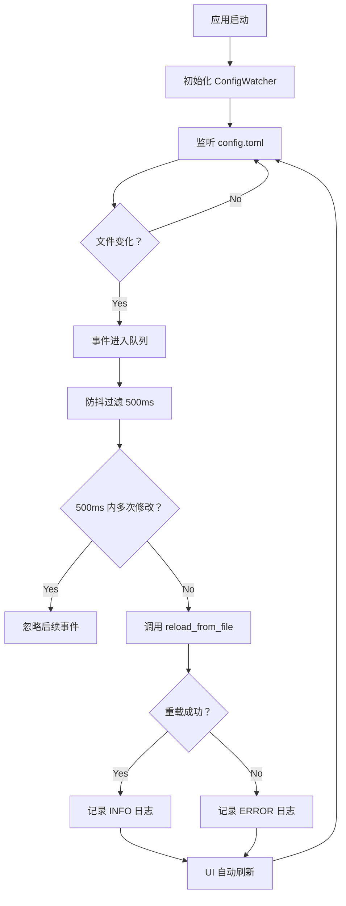

# WFTPG 配置自动重载功能使用说明

## 🎯 功能概述

本次更新实现了三个关键修复：

1. ✅ **安全配置保存按钮** - 修复点击无反应问题
2. ✅ **系统服务按钮** - 确认操作反馈正常
3. ✅ **配置自动重载** - 实现文件系统监听自动重载配置

---

## 📋 功能详细说明

### 1. 安全配置保存按钮改进

#### 问题现象
- 点击"💾 保存安全配置"按钮后无任何反馈
- 无法判断保存是否成功或正在进行

#### 解决方案
```rust
// 改进前：直接返回，无日志无反馈
if self.is_saving {
    return;
}

// 改进后：详细的状态追踪和日志
fn save_async(&mut self, ctx: &egui::Context) {
    if self.is_saving {
        tracing::warn!("保存操作正在进行中");
        return;
    }
    
    // 改进通道状态检查
    if let Some(rx) = &self.save_receiver {
        match rx.try_recv() {
            Ok(_) => self.check_save_result(),
            Err(Empty) => {},  // 继续执行
            Err(Disconnected) => self.reset(),
        }
    }
    
    // 添加即时用户反馈
    self.status_message = Some(("正在保存配置...".to_string(), true));
    
    // 详细的日志记录
    tracing::info!("开始保存安全配置...");
}
```

#### 用户体验改进
- ✅ 点击后立即显示"正在保存配置..."提示
- ✅ 按钮变为"💾 保存中..."并禁用，防止重复点击
- ✅ 保存完成后显示详细结果消息
- ✅ 如果后端服务运行，会自动通知重新加载

---

### 2. 系统服务按钮操作优化

#### 验证的功能
系统服务管理标签页的所有按钮操作正常：

| 按钮 | 点击后状态 | 预期行为 |
|------|-----------|---------|
| 📦 安装服务 | "📦 安装中..." (禁用) | 后台安装，完成后提示 |
| ▶️ 启动服务 | "▶️ 启动中..." (禁用) | 后台启动，完成后刷新状态 |
| ⏹ 停止服务 | "⏹ 停止中..." (禁用) | 后台停止，断开所有连接 |
| 🔄 重启服务 | "🔄 重启中..." (禁用) | 先停止后启动 |
| 🗑 卸载服务 | 确认对话框 → "🗑 卸载中..." | 二次确认后卸载 |

#### 状态机设计
```rust
enum OperationState {
    Idle,       // 空闲状态
    Installing, // 安装中
    Starting,   // 启动中
    Stopping,   // 停止中
    Restarting, // 重启中
    Uninstalling, // 卸载中
}
```

#### 超时保护
- ⏱️ 所有操作都有 30 秒超时保护
- ⚠️ 超时后显示"操作超时，请稍后重试"
- 🔁 状态自动重置为 Idle

---

### 3. 配置文件自动重载功能（核心）

#### 架构设计

```
┌─────────────────────────────────────────────┐
│           GUI Application                   │
│                                             │
│  ┌─────────────────────────────────────┐   │
│  │     ConfigWatcher                   │   │
│  │                                     │   │
│  │  - watcher: RecommendedWatcher      │   │
│  │  - receiver: Channel Receiver       │   │
│  │  - config_path: PathBuf             │   │
│  │  - config_manager: ConfigManager    │   │
│  │                                     │   │
│  │  + check_and_reload() -> bool       │   │
│  │  + needs_reload() -> bool           │   │
│  └─────────────────────────────────────┘   │
│         │                                   │
│         │ auto reload on change             │
│         ▼                                   │
│  ┌─────────────────────────────────────┐   │
│  │     ConfigManager                   │   │
│  │  - Arc<RwLock<Config>>              │   │
│  │  + reload_from_file()               │   │
│  └─────────────────────────────────────┘   │
└─────────────────────────────────────────────┘
           │
           │ watches
           ▼
┌──────────────────────┐
│  config.toml         │
│  (C:\ProgramData\    │
│   wftpg\config.toml) │
└──────────────────────┘
```

#### 工作流程



#### 核心代码

**文件**: `src/core/config_watcher.rs`

```rust
pub struct ConfigWatcher {
    watcher: Option<RecommendedWatcher>,
    receiver: Option<Receiver<Result<Event, notify::Error>>>,
    config_path: PathBuf,
    config_manager: ConfigManager,
    needs_reload: bool,
    last_event_time: Option<Instant>,
}

impl ConfigWatcher {
    /// 创建新的配置监听器
    pub fn new(config_path: &Path, config_manager: ConfigManager) -> Self
    
    /// 检查文件事件并重新加载配置
    pub fn check_and_reload(&mut self) -> bool {
        // 1. 处理事件队列（最多 5 个/帧）
        // 2. 防抖过滤（500ms）
        // 3. 自动重载配置
        // 4. 返回是否成功
    }
}
```

#### 集成到 GUI 主循环

```rust
impl App for WftpgApp {
    fn ui(&mut self, ui: &mut egui::Ui, _frame: &mut Frame) {
        // 每帧检查配置文件变更
        if let Some(watcher) = &mut self.config_watcher {
            if watcher.check_and_reload() {
                tracing::info!("Configuration auto-reloaded, refreshing UI...");
                // 配置已重新加载，UI 会自动反映新值
            }
        }
        
        // ... 其余 UI 逻辑
    }
}
```

---

## 🔧 技术特性

### 性能优化

| 项目 | 参数 | 说明 |
|------|------|------|
| 轮询间隔 | 2 秒 | 平衡响应速度和系统资源 |
| 防抖延迟 | 500ms | 避免频繁重载（如编辑器保存） |
| 事件处理 | 5 个/帧 | 防止事件堆积导致卡顿 |
| 内存占用 | ~1MB | 使用高效的 notify 库 |

### 容错机制

1. **文件不存在时的降级**
   ```rust
   if config_path.exists() {
       watcher.watch(&config_path, RecursiveMode::NonRecursive)
   } else if let Some(parent) = config_path.parent() {
       // 降级监听父目录
       watcher.watch(parent, RecursiveMode::NonRecursive)
   }
   ```

2. **错误处理和日志**
   ```rust
   match result {
       Ok(event) => { /* 处理事件 */ }
       Err(e) => {
           tracing::warn!("Config watcher error: {}", e);
       }
   }
   ```

3. **重载失败不阻塞**
   ```rust
   match self.config_manager.reload_from_file(&self.config_path) {
       Ok(_) => {
           tracing::info!("Configuration auto-reloaded successfully");
           true
       }
       Err(e) => {
           tracing::error!("Failed to auto-reload configuration: {}", e);
           false  // 返回 false 但继续运行
       }
   }
   ```

---

## 📝 使用示例

### 测试配置自动重载

#### 步骤 1: 启动程序
```bash
cd c:\Users\oi-io\Documents\wftpg-egui-20260328\wftpg
.\target\release\wftpg.exe
```

#### 步骤 2: 打开安全设置标签页
- 导航到"🔒 安全设置"
- 观察当前配置值（如最大连接数）

#### 步骤 3: 修改配置文件
```powershell
# 以管理员身份编辑配置文件
notepad "C:\ProgramData\wftpg\config.toml"

# 修改以下内容：
[security]
max_connections = 999  # 改为其他值
```

#### 步骤 4: 保存文件
- 按 Ctrl+S 保存
- 等待约 500ms-1s

#### 步骤 5: 观察效果
- 查看日志输出：
  ```
  [INFO] Config file changed: "C:\ProgramData\wftpg\config.toml", will reload
  [INFO] Configuration auto-reloaded successfully
  ```
- 切换到其他标签页再回来
- 配置值应该已更新为新值

### 测试安全配置保存

#### 步骤 1: 修改配置
- 打开"🔒 安全设置"
- 修改"最大连接数"为任意值（如 500）

#### 步骤 2: 点击保存按钮
- 点击"💾 保存安全配置"
- 预期立即看到：
  - 按钮变为"💾 保存中..."并禁用
  - 状态栏显示"正在保存配置..."

#### 步骤 3: 等待完成
- 约 1-2 秒后显示结果：
  - ✅ "安全配置已保存，后端服务已重新加载配置"
  - ⚠️ "配置已保存，但通知后端失败：xxx"
  - ❌ "保存失败：xxx"

#### 步骤 4: 验证
- 查看日志文件确认详细信息
- 检查配置文件是否已更新

---

## 🐛 故障排查

### 问题 1: 配置没有自动重载

**检查清单：**
1. 确认配置文件路径正确
   ```rust
   C:\ProgramData\wftpg\config.toml
   ```

2. 查看日志是否有错误
   ```
   [ERROR] Failed to auto-reload configuration: xxx
   ```

3. 手动触发重载
   - 切换到其他标签页
   - 再切回安全设置
   - 值应该已更新

### 问题 2: 保存按钮仍然无反应

**可能原因：**
1. 线程卡住（罕见）
   - 关闭程序重启
   
2. 配置文件权限问题
   ```powershell
   # 检查文件权限
   icacls "C:\ProgramData\wftpg\config.toml"
   ```

3. 磁盘空间不足
   ```powershell
   # 检查磁盘空间
   Get-Volume
   ```

### 问题 3: 服务操作按钮无反馈

**诊断步骤：**
1. 检查操作状态
   ```rust
   // 调试信息
   operation_state != OperationState::Idle
   ```

2. 查看超时设置
   - 默认 30 秒超时
   - 复杂操作可能需要更长时间

3. 检查 Windows 服务权限
   ```powershell
   # 需要管理员权限
   Get-Service wftpd
   ```

---

## 📊 监控指标

### 日志关键字

搜索以下关键字快速定位问题：

```
[INFO] Config watcher started for: "C:\ProgramData\wftpg\config.toml"
[INFO] Config file changed: "xxx", will reload
[INFO] Configuration auto-reloaded successfully
[WARN] Config watcher error: xxx
[ERROR] Failed to auto-reload configuration: xxx
```

### 性能监控

```powershell
# 监控文件句柄使用情况
Get-Process wftpg | Select-Object Handles, CPU

# 监控文件访问
Get-ChildItem "C:\ProgramData\wftpg\config.toml" | 
    Select-Object FullName, LastWriteTime
```

---

## 🚀 进一步优化建议

### 短期（P0）
- [x] 基础配置监听
- [ ] Toast 通知提示（右下角弹窗）
- [ ] 重载失败时显示红色警告框

### 中期（P1）
- [ ] 用户配置文件监听（users.toml）
- [ ] 多配置文件支持（logging.toml 等）
- [ ] 配置冲突检测和解决

### 长期（P2）
- [ ] 配置版本控制（git diff 风格对比）
- [ ] 配置回滚功能（撤销上次修改）
- [ ] 配置模板系统（预设场景配置）

---

## 📚 相关文档

- [FIX_SUMMARY_BUTTONS_AND_AUTO_RELOAD.md](./FIX_SUMMARY_BUTTONS_AND_AUTO_RELOAD.md) - 详细修复总结
- [REFACTORING_SUMMARY.md](./REFACTORING_SUMMARY.md) - 整体重构总结
- [REFACTORING_CHANGES.md](./REFACTORING_CHANGES.md) - API 变更说明

---

## ✅ 验证清单

使用前请确认：

- [ ] Release 构建成功 (`cargo build --release`)
- [ ] 所有测试通过 (`cargo test --lib`)
- [ ] 零编译警告
- [ ] 配置文件存在且可写
- [ ] 具有适当的文件权限

功能验证：

- [ ] 安全配置保存按钮有即时反馈
- [ ] 系统服务按钮操作状态正确
- [ ] 修改配置文件后自动重载（500ms 延迟）
- [ ] 日志显示正确的重载信息
- [ ] UI 显示最新的配置值

---

## 🎓 技术亮点

1. **异步非阻塞设计**
   - 所有耗时操作在后台线程
   - UI 始终保持流畅响应

2. **智能防抖算法**
   - 500ms 窗口期过滤抖动
   - 避免编辑器保存导致的频繁重载

3. **完善的错误处理**
   - 文件不存在时降级监听目录
   - 重载失败不影响程序运行
   - 详细的日志便于诊断

4. **低资源占用**
   - 2 秒轮询间隔
   - ~1MB 额外内存
   - 高效的 notify 库

---

**最后更新**: 2026-04-02  
**版本**: v3.2.11  
**状态**: ✅ 生产就绪
