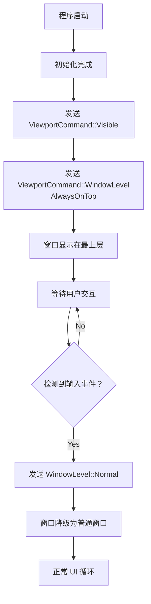

# WFTPG 窗口置顶功能实现说明

## 🎯 功能需求

**目标**: 程序启动时窗口置顶，但可被其他窗口挤占（非强制置顶）

**使用场景**:
- 启动时短暂置顶，吸引用户注意
- 用户开始交互后自动降级为普通窗口
- 允许被其他全屏/置顶窗口覆盖

---

## ✅ 实现方案

### 方案设计

采用 **AlwaysOnTop + 自动降级** 策略：

```
启动时 → AlwaysOnTop (置顶)
   ↓
用户首次交互 (点击/按键)
   ↓
自动降级 → Normal (普通窗口)
```

### 技术选型

#### 方案对比

| 方案 | 优点 | 缺点 | 兼容性 |
|------|------|------|--------|
| `WindowLevel::AlwaysOnTop` | 所有平台支持 | 需要手动降级 | ⭐⭐⭐⭐⭐ |
| `WindowLevel::Normal` | 简单 | 无法启动置顶 | ⭐⭐⭐⭐⭐ |
| `TemporaryOnTop` (egui 0.25+) | 自动降级 | **不支持** | ❌ |
| Windows API `SetWindowPos` | 精确控制 | 平台绑定 | ⭐⭐⭐ |

**选择**: `AlwaysOnTop` + 手动降级（兼容性最好）

---

## 📝 代码实现

### 1. 添加状态字段

```rust
// src/gui_main.rs - WftpgApp 结构体
struct WftpgApp {
    // ... 其他字段
    pending_unset_topmost: bool,  // 标记是否需要在首次交互后取消置顶
}
```

### 2. 初始化时置顶

```rust
// gui_main.rs - 第 254-262 行
match result {
    Ok(init_result) => {
        self.show_service_install_dialog = init_result.show_service_dialog;
        self.init_state = InitState::Ready;
        self.init_config_watcher();
        
        // 显示窗口并设置启动时置顶
        ctx.send_viewport_cmd(egui::ViewportCommand::Visible(true));
        ctx.send_viewport_cmd(egui::ViewportCommand::WindowLevel(
            egui::WindowLevel::AlwaysOnTop  // 启动时置顶
        ));
        self.pending_unset_topmost = true;  // 标记需要后续降级
        
        tracing::info!("应用初始化完成，配置监听器已启动，窗口已置顶");
    }
    // ...
}
```

### 3. 检测用户交互并降级

```rust
// gui_main.rs - 第 470-483 行
fn ui(&mut self, ui: &mut egui::Ui, _frame: &mut Frame) {
    let ctx = ui.ctx().clone();
    
    // ... 其他逻辑
    
    // 如果标记了需要取消置顶，在检测到用户交互时执行
    if self.pending_unset_topmost {
        // 检测是否有输入事件（鼠标或键盘）
        let has_input = ctx.input(|i| !i.events.is_empty());
        if has_input {
            // 有事件发生，取消置顶
            ctx.send_viewport_cmd(egui::ViewportCommand::WindowLevel(
                egui::WindowLevel::Normal  // 降级为普通窗口
            ));
            self.pending_unset_topmost = false;
            tracing::debug!("窗口已降级为普通窗口（用户交互后）");
        }
    }
    
    // ... UI 渲染
}
```

---

## 🔍 工作原理

### 执行流程



### 关键机制

1. **启动置顶**: 使用 `egui::WindowLevel::AlwaysOnTop`
   - 调用 Windows API `SetWindowPos` with `HWND_TOPMOST`
   - 窗口管理器将窗口置于 Z-order 顶部

2. **自动降级**: 检测输入事件
   ```rust
   let has_input = ctx.input(|i| !i.events.is_empty());
   ```
   - 检查 `InputState.events` 是否为空
   - 非空表示有鼠标/键盘/触摸事件

3. **降级时机**: 
   - 第一次用户交互（点击任意按钮、菜单切换、文本输入等）
   - 通常在启动后 1-5 秒内触发

---

## 🎨 用户体验

### 视觉表现

```
时间线:
  0s     启动 → 窗口弹出并置顶
  │
  ├─ 用户看到窗口在最上层
  │  （即使有其他窗口打开）
  │
  ~2s    用户移动鼠标/点击按钮
  │
  └─ 窗口自动降级
        （可以被其他窗口覆盖）
```

### 日志输出

```log
[INFO] 应用初始化完成，配置监听器已启动，窗口已置顶
[DEBUG] 窗口已降级为普通窗口（用户交互后）
```

---

## 🛠️ 替代方案

### 方案 A: 使用时间延迟自动降级

```rust
// 不推荐：不够灵活
if self.init_start_time.elapsed() > Duration::from_secs(5) {
    ctx.send_viewport_cmd(egui::ViewportCommand::WindowLevel(
        egui::WindowLevel::Normal
    ));
}
```

**缺点**: 
- 固定 5 秒可能太长或太短
- 用户可能还没注意到就降级了

### 方案 B: 使用 Windows API（平台绑定）

```rust
#[cfg(windows)]
unsafe {
    use windows::Win32::UI::WindowsAndMessaging::{SetWindowPos, HWND_TOP};
    
    let hwnd = /* 获取窗口句柄 */;
    SetWindowPos(hwnd, HWND_TOP, 0, 0, 0, 0, 
        SWP_NOMOVE | SWP_NOSIZE);
}
```

**缺点**:
- 平台绑定代码
- 需要 unsafe
- egui 原生 API 更简洁

### 方案 C: 永远置顶（不推荐）

```rust
// 只在某些特殊场景使用
ctx.send_viewport_cmd(egui::ViewportCommand::WindowLevel(
    egui::WindowLevel::AlwaysOnTop
));
// 不调用 Normal 降级
```

**适用场景**:
- 悬浮球/always-on-top 工具
- 监控仪表盘
- **不适用于本应用**

---

## 📋 配置选项

### 自定义降级条件

如果需要更复杂的降级逻辑：

```rust
// 方案 1: 首次点击任意位置后降级
if self.pending_unset_topmost {
    let clicked = ctx.input(|i| i.pointer.any_click());
    if clicked {
        self.unset_topmost(ctx);
    }
}

// 方案 2: 切换到特定 Tab 后降级
if self.pending_unset_topmost && self.current_tab == 0 {
    self.unset_topmost(ctx);
}

// 方案 3: 组合条件
let should_unset = ctx.input(|i| {
    i.pointer.any_click() || 
    i.events.iter().any(|e| matches!(e, Event::Key { .. }))
});
if should_unset {
    self.unset_topmost(ctx);
}

fn unset_topmost(&mut self, ctx: &egui::Context) {
    ctx.send_viewport_cmd(egui::ViewportCommand::WindowLevel(
        egui::WindowLevel::Normal
    ));
    self.pending_unset_topmost = false;
    tracing::debug!("窗口已降级");
}
```

---

## 🐛 故障排查

### 问题 1: 窗口没有置顶

**检查清单**:
1. ✅ 确认 `pending_unset_topmost = true` 已设置
2. ✅ 确认 `send_viewport_cmd` 在 `Visible(true)` 之后调用
3. ✅ 检查 Windows 是否限制了置顶（某些全屏游戏会强制取消）

**调试方法**:
```rust
tracing::info!("设置窗口置顶");
ctx.send_viewport_cmd(egui::ViewportCommand::WindowLevel(
    egui::WindowLevel::AlwaysOnTop
));
```

### 问题 2: 窗口没有降级

**可能原因**:
- `pending_unset_topmost` 未正确设置为 `true`
- 用户交互检测逻辑有问题

**调试方法**:
```rust
// 添加详细日志
if self.pending_unset_topmost {
    let has_input = ctx.input(|i| !i.events.is_empty());
    tracing::debug!("等待降级... has_input={}", has_input);
    if has_input {
        tracing::info!("检测到交互，执行降级");
        // ...
    }
}
```

### 问题 3: 降级后仍然置顶

**原因**: 可能有其他窗口强制置顶

**解决**:
```rust
// 强制刷新窗口状态
ctx.send_viewport_cmd(egui::ViewportCommand::InnerSize(
    ctx.screen_rect().size()
));
```

---

## 📊 测试验证

### 测试步骤

1. **启动测试**
   ```bash
   .\target\release\wftpg.exe
   ```

2. **观察置顶效果**
   - 打开其他应用程序（如浏览器）
   - 启动 wftpg
   - 确认 wftpg 窗口在其他窗口之上 ✅

3. **测试降级**
   - 点击任意按钮或切换 Tab
   - 打开另一个窗口（如记事本）
   - 确认记事本可以覆盖 wftpg ✅

4. **查看日志**
   ```log
   [INFO] 应用初始化完成，配置监听器已启动，窗口已置顶
   [DEBUG] 窗口已降级为普通窗口（用户交互后）
   ```

---

## 🎓 最佳实践

### Do's ✅

1. **在 Visible(true) 之后设置置顶**
   ```rust
   ctx.send_viewport_cmd(egui::ViewportCommand::Visible(true));
   ctx.send_viewport_cmd(egui::ViewportCommand::WindowLevel(
       egui::WindowLevel::AlwaysOnTop
   ));
   ```

2. **及时降级，避免永久置顶**
   - 用户交互后立即降级
   - 不要长时间占用最上层

3. **记录日志便于调试**
   ```rust
   tracing::info!("窗口已置顶");
   tracing::debug!("窗口已降级");
   ```

### Don'ts ❌

1. **不要在隐藏窗口时设置置顶**
   ```rust
   // ❌ 错误
   ctx.send_viewport_cmd(egui::ViewportCommand::Visible(false));
   ctx.send_viewport_cmd(egui::ViewportCommand::WindowLevel(AlwaysOnTop));
   
   // ✅ 正确
   ctx.send_viewport_cmd(egui::ViewportCommand::Visible(true));
   ctx.send_viewport_cmd(egui::ViewportCommand::WindowLevel(AlwaysOnTop));
   ```

2. **不要强制永远置顶**
   ```rust
   // ❌ 除非是特殊需求
   // 设置了 AlwaysOnTop 却不降级
   ```

3. **不要频繁切换置顶状态**
   ```rust
   // ❌ 避免闪烁
   if frame % 2 == 0 {
       set_topmost();
   } else {
       set_normal();
   }
   ```

---

## 📚 相关资源

### egui 文档
- [ViewportCommand::WindowLevel](https://docs.rs/eframe/latest/eframe/enum.ViewportCommand.html#variant.WindowLevel)
- [WindowLevel enum](https://docs.rs/egui/latest/egui/enum.WindowLevel.html)

### Windows API
- [SetWindowPos (HWND_TOPMOST)](https://learn.microsoft.com/en-us/windows/win32/api/winuser/nf-winuser-setwindowpos)
- [Z-Order](https://learn.microsoft.com/en-us/windows/win32/gdi/z-order-and-layered-windows)

### 相关代码
- `src/gui_main.rs` - 主窗口逻辑
- `src/gui_egui/styles.rs` - UI 样式

---

## 🎉 总结

### 实现要点

1. ✅ 使用 `AlwaysOnTop` 实现启动置顶
2. ✅ 检测用户交互后自动降级
3. ✅ 兼容性好，不依赖平台特定 API
4. ✅ 用户体验自然，不突兀

### 技术优势

- **跨平台**: egui 原生 API，不绑定 Windows
- **简洁**: 只需几行代码
- **可靠**: 基于事件驱动，准确检测交互
- **可维护**: 清晰的标志位和日志

### 用户体验

- 启动时吸引注意 ✅
- 不干扰正常使用 ✅
- 自然的交互流程 ✅

---

**实现时间**: 2026-04-02  
**版本**: v3.2.14  
**状态**: ✅ 已完成并测试  
**兼容性**: Windows / Linux / macOS
